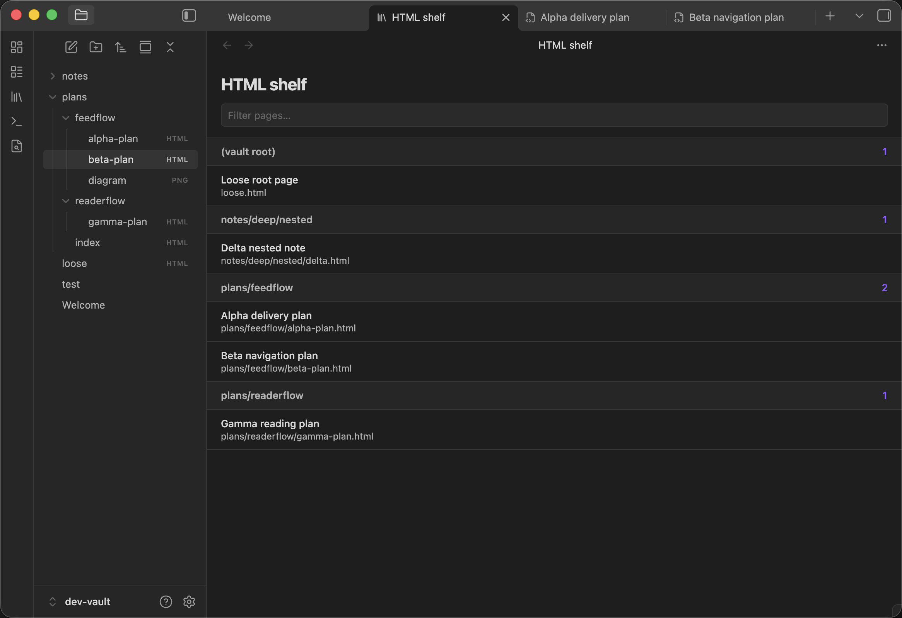
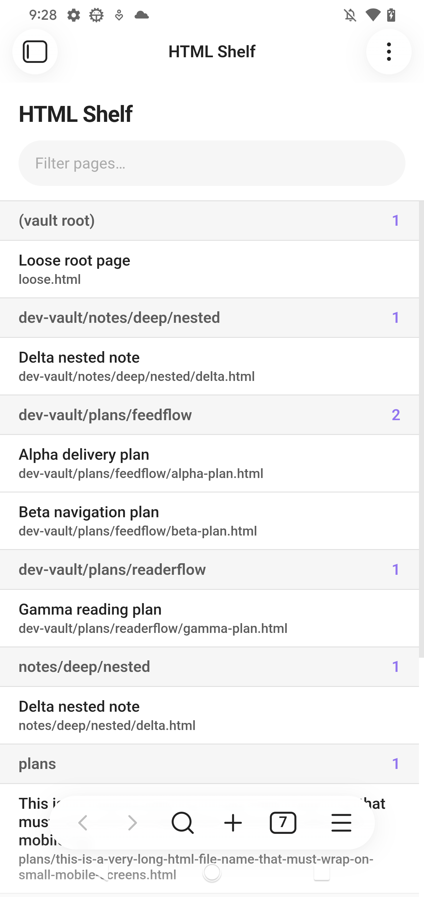
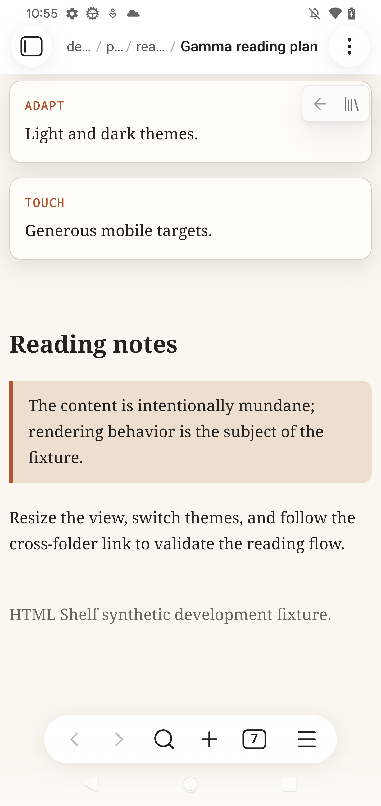

# HTML Shelf

HTML Shelf discovers and reads the HTML files in your vault on mobile and desktop. It solves the awkward mobile workflow where HTML files are absent from Obsidian's file explorer or open in an external browser instead of alongside your notes.

## Screenshots

### Shelf on desktop



### Shelf on Android



### Rendered page on Android



The screenshots use only the synthetic development vault included in this repository.

## Install

### Obsidian community plugins

1. Open **Settings → Community plugins** in Obsidian.
2. Select **Browse** and search for **HTML Shelf**.
3. Select **Install**, then **Enable**.

### Manual

1. Download `main.js`, `manifest.json`, and `styles.css` from the latest release.
2. Put all three files in `<vault>/.obsidian/plugins/html-shelf/`.
3. Reload Obsidian, then enable **HTML Shelf** under **Settings → Community plugins**.

### Obsidian Sync

Obsidian Sync does not sync `.html` and `.htm` files by default. If your HTML
library is stored on another device, enable **Settings → Sync → Selective
sync → Sync all other types** on both the source device and every device that
should receive the files. This setting is device-specific.

Restart Obsidian after changing the setting; on mobile, force-quit the app and
reopen it. Wait for Sync to finish before opening HTML Shelf. Also confirm that
the library folder is not listed under **Excluded folders** in the Sync settings.

## Usage

- Select the library icon in the ribbon, or run **HTML Shelf: Open shelf** from the command palette.
- Type in **Filter pages** to search titles, paths, and sections.
- Select a page to render it inside Obsidian. Relative links to other HTML pages remain inside the plugin; the page bar provides Back and Shelf controls.
- Long-press a page on mobile, or right-click it on desktop, to delete it after confirmation. Obsidian's deleted-files preference determines how the file is removed.
- Open **Settings → HTML Shelf** to include specific folders, exclude subtrees, or hide `.htm` files from the shelf. Changes apply immediately.

`index.html` and `index.htm` files are treated as navigation targets and are not listed on the shelf.

## Optional `html-shelf.json` curation

A folder may contain an `html-shelf.json` file to curate how pages beneath that folder appear:

```json
{
  "title": "AI plans",
  "entries": [
    {
      "path": "feedflow/foo-plan.html",
      "title": "Foo plan",
      "section": "FeedFlow"
    },
    {
      "path": "readerflow/bar-plan.html",
      "title": "Bar plan",
      "section": "ReaderFlow"
    }
  ]
}
```

- `title` is an optional library display name.
- `entries` is required. Every entry requires `path` and `title`; `section` is optional.
- `path` is relative to the folder containing the manifest. Absolute paths and paths containing `..` are rejected.
- An explicit section is displayed as `<library title> · <section>` when the manifest has a title, or simply `<section>` otherwise.
- An entry without `section` keeps its normal scan-derived section, without the library-title prefix, so it remains grouped with unlisted siblings.
- Unlisted HTML files still appear normally. A manifest curates; it does not hide files. Index files remain hidden.
- When nested manifests cover the same file, the deepest manifest wins.
- Invalid manifests are ignored, normal scanning continues, and Obsidian shows a notice.

## Security

HTML Shelf treats vault HTML as untrusted content. Scripts, event handlers, embedded frames and objects, refresh redirects, executable URLs, remote stylesheets, and inline CSS `@import` rules are removed before rendering. Desktop and Android use a sandboxed iframe without script permission; iOS uses a sanitized, isolated Shadow DOM renderer because its WebView does not reliably support the same iframe navigation behavior.

Some network-capable content remains intentionally supported:

- Remote images and media referenced by a page may load, including tracking pixels.
- Inline CSS may fetch remote resources through `url()`, including backgrounds, fonts, and cursors.
- A referenced local CSS file is loaded unmodified and may itself import remote CSS.

These have the same privacy implications as opening that HTML in a browser. Review HTML from untrusted sources before adding it to your vault.

## Limitations

- Relative links to non-HTML files, such as an image wrapped in an `<a>` element, do not open in the initial release.
- Relative paths are case-sensitive. A link whose casing differs from the vault file is reported as missing.
- **Include .htm files** affects the shelf listing only. A `.htm` file opened directly still renders.
- HTML Shelf does not export or rewrite source files.

## Contributing

Issues and pull requests are welcome. Install Node.js 20 or newer, then run:

```sh
npm ci
npm run check
```

Use the synthetic `dev-vault/` fixtures for screenshots, tests, and bug reports. Do not commit content from a personal vault.

## License

[MIT](LICENSE) © 2026 Marco Gomiero
